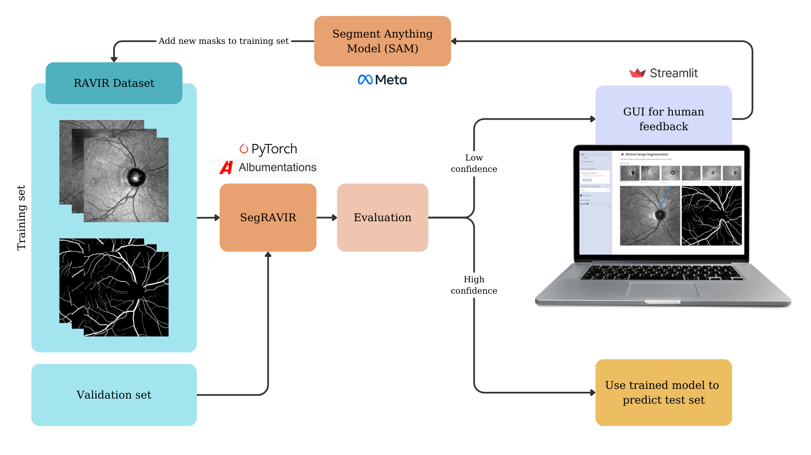

# 👁️ Retinal Vessel Segmentation with Human-in-the-Loop

This project explores the application of human-in-the-loop segmentation techniques on the RAVIR dataset using SegRAVIR and the Segment Anything Model (SAM) developed by Meta AI. By incorporating human interactions where users can annotate arteries and veins through a Streamlit-based user interface, this study aims to enhance segmentation accuracy and reliability.

## File Structure

```
├── .streamlit
│   └── config.toml
├── data
│   ├── test
│   └── train
├── gui
│   ├── checkpoint
│   │   ├── sam_vit_b_01ec64.pth
│   │   └── sam_vit_l_0b3195.pth
│   ├── pages
│   │   └── 1_📄_About.py
│   ├── train
│   ├── 👁️_Retinal_segmentation.py
│   ├── packages.txt
│   ├── pipeline.png
│   └── util.py
├── model
│   └── trained_model.pth
└── src
    ├── __pycache__
    ├── dataset.py
    ├── segravir.py
    └── utils.py
```

## Installation

1. Clone the repository:
    ```bash
    git clone https://github.com/nathanyaqueby/retinal-vessel-segmentation.git
    cd retinal-vessel-segmentation
    ```

2. Create a virtual environment and activate it:
    ```bash
    python -m venv venv
    source venv/bin/activate  # On Windows use `venv\Scripts\activate`
    ```

3. Install the required packages:
    ```bash
    pip install -r requirements.txt
    ```

## Usage

### Training the Segmentation Model

1. Place your training data in the `data/train` directory and testing data in the `data/test` directory.

2. Run the training script:
    ```bash
    python src/segravir.py
    ```

### Running the Streamlit Interface

1. Launch the Streamlit GUI for human-in-the-loop feedback:
    ```bash
    streamlit run gui/train/👁️_Retinal_segmentation.py
    ```

2. Access the GUI at `http://localhost:8501` and provide annotations for the retinal images.

### Incorporating Human Feedback

Annotated masks from the human-in-the-loop process can be used to retrain the segmentation model. These masks should be aggregated and integrated into the training dataset to improve the model's performance.

## Workflow Diagram



*Figure: Workflow diagram of the human-in-the-loop segmentation pipeline. The diagram illustrates the iterative process of integrating user annotations to refine model predictions and improve segmentation accuracy. Low-confidence samples are sent for human feedback via the Streamlit GUI.*

## Data Augmentation

Data augmentation techniques applied to retinal images and their corresponding segmentation masks help improve model robustness by introducing variability in the training data.

*Figure: Illustration of data augmentation techniques applied to retinal images and their corresponding segmentation masks. The top row displays the original image and augmented versions created using Vertical Flip, Horizontal Flip, Perspective, Affine, and Piecewise Affine transformations. The bottom row shows the respective segmentation masks for each augmented image, highlighting the structural changes induced by the augmentations.*

## Results and Evaluation

The evaluation metrics used in this study include the Dice Coefficient and Jaccard Index (Intersection over Union), providing a measure of the overlap between the predicted segmentation masks and the ground truth masks.
